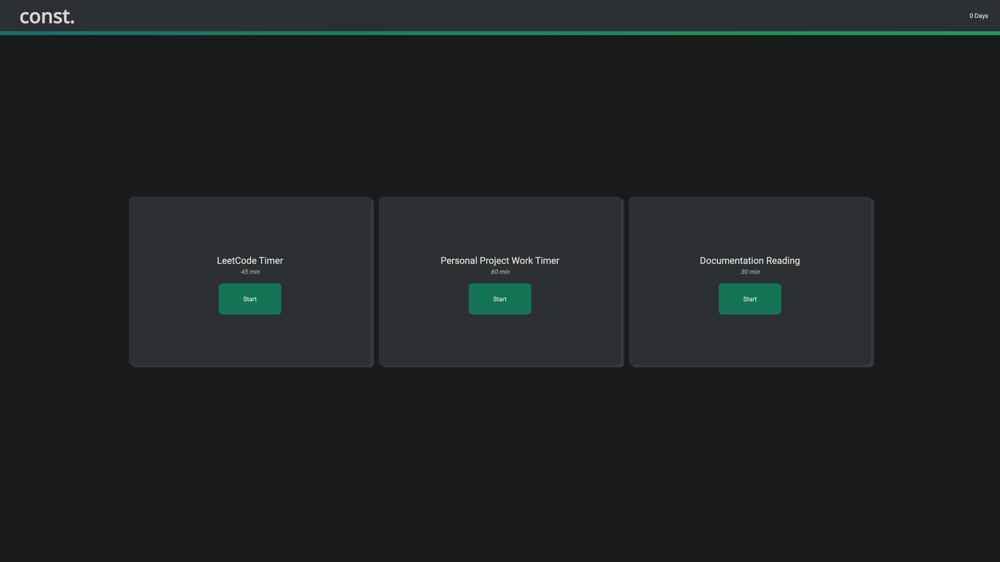

# const.
Website mimicking functionality of 75Hard workout program, redesigned for lazy coders that need motivation.

[Website Link](https://opaleone.github.io/75Code/)

## Usage

This website is designed to motivate you to complete tasks that will improve your skills in programming. 

The concept is simple. 

Start the timer and begin working on the activity linked to that timer. The timer will count down and when it reaches 0, the activity card will display...

>*DONE!*

The website will keep track of which activities are completed and on the next day, as long as all activities are completed, will add 1 to your day counter at the top right of the screen. 

>If one of the activities timers are not completed before *midnight*, the day counter will reset to 0.

## To End

Hopefully, you can use this to motivate you to code.

>Constantly Learning. Constantly Coding. Constantly Improving.

# const.

